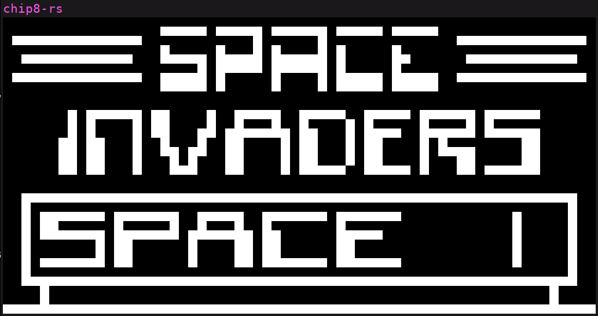
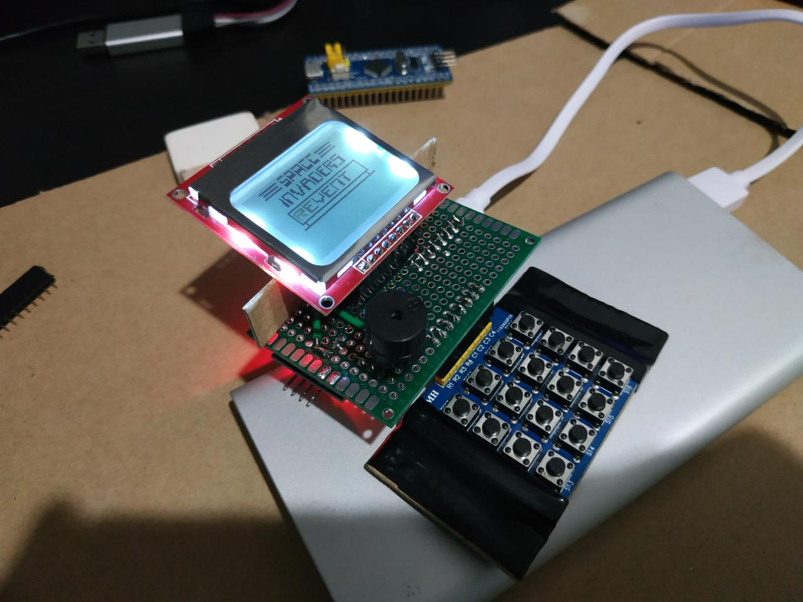

# chip8-rs

Rust no_std implementation of the chip8 virtual machine.

The chip8 is implemented as a library to be used like a backend.  The frontend
must implement a way to call `Chip8::frame()` at 60 frames, and handle keyboard
events, output a tone, and draw the framebuffer into a display.

This repository contains two frontend implementation for two platforms:

- Linux (Using SDL2 for display drawing, keyboard events and tone)



- STM32F103 (Using [pcd8544-hal](https://github.com/dancek/pcd8544-hal) for
  display drawing and
  [stm32f1xx-hal](https://github.com/stm32-rs/stm32f1xx-hal) for keybard, tone
  and main loop).

I built the STM32 version using a [Blue
Pill](https://stm32duinoforum.com/forum/wiki_subdomain/index_title_Blue_Pill.html)
in a portable form.  I call it **E2SPA Mk I** which stands for *Electronic
Entertainment System for the Post Apocalypse*.


# SDL2 

Build
```
cd sdl
cargo build --target x86_64-unknown-linux-gnu --bin sdl
```

# STM32

Build
```
cd stm32
cargo build --bin stm32 --release
```

Flashing on a blue pill
```
cd stm32
./flash.sh
```

# License

GPLv3
